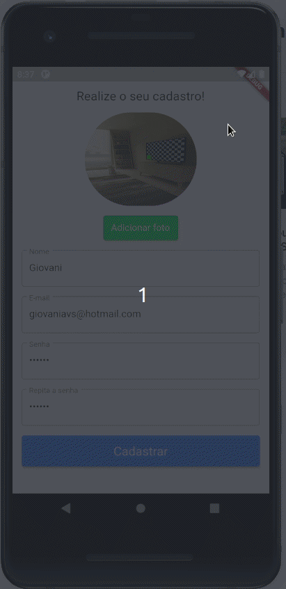
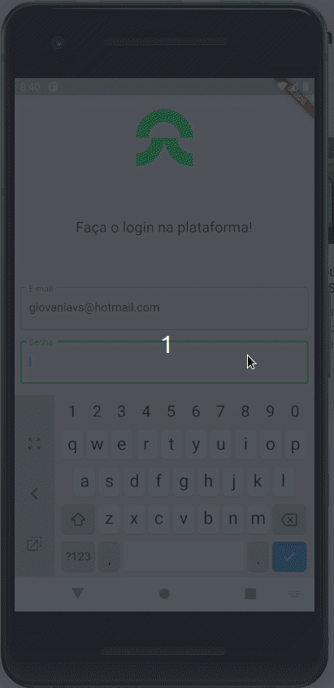
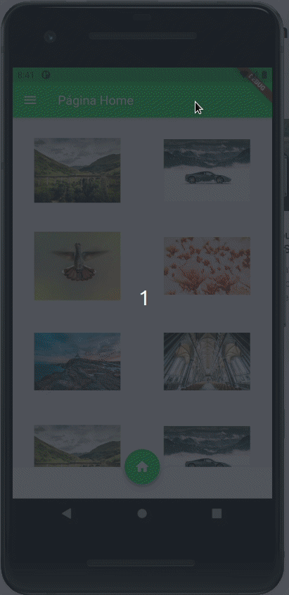
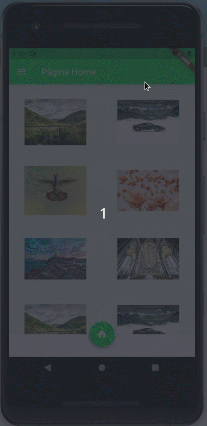
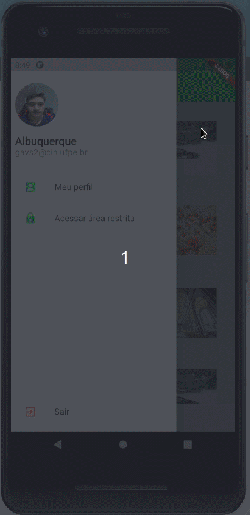
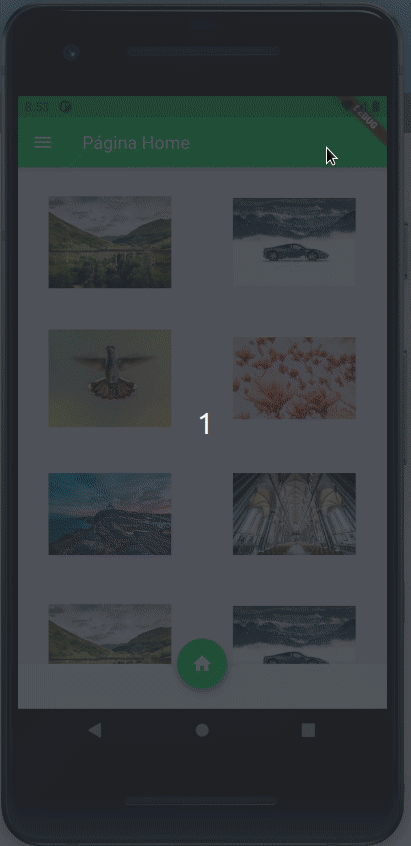

# Capyba Challenge

<h1 align="center">
  
</h1>

<p align="center">This is the challange created by Capyba. The main goal of this project is build an App with login, account registration and update informations integrated with FireBase. The technologies used to assembly this App were Flutter, Fire Store, Firebase Authenticator and Fire Storage.
</p>

<p align="center">
  <a href="https://github.com/Giovaniavs">
    
  </a>
</p>


---

## Table of Contents

<ul>
  <li><a href="#-getting-started">Getting Started</a></li>
  <li><a href="#-features">Features</a></li>
  <li><a href="#-support">Support</a></li>
</ul>

---

## 👉 Getting Started

### Prerequisites
 
 - You have to have in your PC the Flutter correctly installed to run this project.

### Clone

- Clone this repo to your local machine using:

```
https://github.com/Giovaniavs/Capyba_Challenge.git
```

### Setup

- To run in debug mode, open your editor, go to the source of the project and run;
  - ```bash
    flutter run
    ```
- If you want to run the APK, conect your device in your PC, go to the source of the project and run;
  - ```bash
    flutter install
    ```
- After that, you'll be able to run the App in your device.


---

## 🖥️ Features

<h2 align="center"> Register in the plataform </h2>
  <p align="center">
    
  </p>
<br>
<h2 align="center"> Log in </h2>
  <p align="center">
    
  </p>
<br>
<h2 align="center"> Validate your email </h2>
  <p align="center">
    
  </p>
  <p align="center"> After verify the email, you have to make the login again! </p>
<br>
<h2 align="center"> Access to the restricted area if you've confirmed the email </h2>
  <p align="center">
    
  </p>
<br>
<h2 align="center"> Edit your profile informations! </h2>
  <p align="center">
    
  </p>
<br>
<h2 align="center"> And... Log out! </h2>
  <p align="center">
    
  </p>
<br>

### Build with

- [Flutter](https://flutter.dev/) - Flutter is Google’s UI toolkit for building beautiful, natively compiled applications for mobile, web, and desktop from a single codebase.
- [Dart](https://dart.dev/) - Dart is a client-optimized language for fast apps on any platform.
- [Firebase](https://firebase.google.com/) - Firebase is Google’s mobile application development platform that helps you build, improve, and grow your app. It offers analytics, authentication, databases, configuration, file storage and push messaging.


---

## 👨 Support

Reach out to me at one of the following places!

- Linkedin at [Giovani Albuquerque](https://www.linkedin.com/in/giovani-albuquerque/)
- Github at [Giovaniavs](https://github.com/Giovaniavs)
- Medium at [Giovani Medium](https://gavs2.medium.com/)